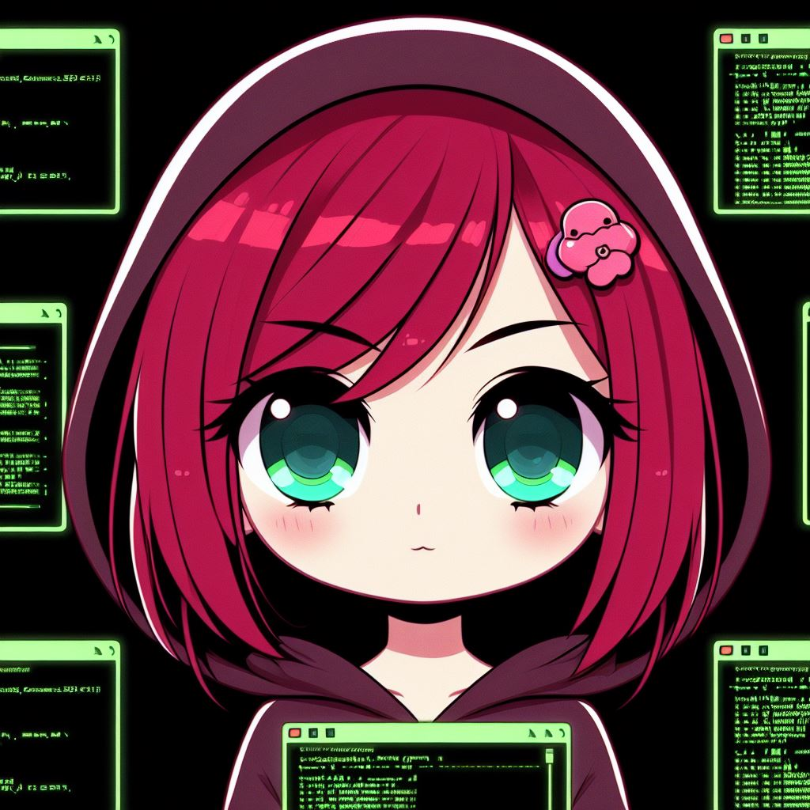

{: width="250" .float-left .mr-3 }
Praca z terminalem
{: .fs-8 .ls-10 .code-example .fw-700}
Chcąc programować, konieczne jest oswojenie się z wierszem poleceń (konsolą/terminalem). Być może kojarzysz go z filmami zawierającymi sceny hackerskie, albo z historycznymi wspomnieniami, gdzie był jedynym sposobem komunikacji z komputerem.

Terminal to specjalne okno w komputerze, gdzie możesz używać tekstowych poleceń do interakcji z systemem. Chociaż współczesne komputery są wyposażone w przyjazne interfejsy graficzne, to terminal pozostaje dostępny dla tych, którzy chcą bardziej bezpośredniej kontroli.

Dzięki terminalowi, nawet gdy używasz myszki i klikasz ikony, możesz wprowadzać skryptowe komendy, uzyskiwać informacje o systemie, zarządzać plikami, czy instalować nowe programy. Dla programistów to narzędzie staje się miejscem, gdzie mogą efektywnie i szybko wykonywać różne zadania, optymalizując pracę z komputerem.

Tak więc, terminal to taki prosty, ale potężny sposób, aby mieć bardziej precyzyjną kontrolę nad komputerem, niezależnie od tego, czy używasz Windowsa, czy systemu operacyjnego z rodziny Unix.

Więcej o wierszu poleceń można przeczytać [tutaj](https://ubuntu.com/tutorials/command-line-for-beginners).

{: .note-title }
> 1. Otwórz terminal (lub wiersz polecenia).
> 2. Utwórz nowy katalog o nazwie `cwiczenie` przy użyciu komendy `mkdir`.
> 3. Przejdź do tego nowo utworzonego katalogu za pomocą komendy `cd`.
> 4. Wewnątrz katalogu `cwiczenia` utwórz kolejne dwa podkatalogi: `katalog1` i `katalog2`.
> 5. Wykorzystaj komendę `ls`, aby wylistować zawartość bieżącego katalogu i upewnij się, że utworzone katalogi są widoczne.
> 6. Przejdź z powrotem do katalogu nadrzędnego używając komendy `cd ..`.
> 7. Odszukaj uwtorzony przez siebie katalog korzystając ze standardowego graficznego interfejsu i eksplorera plików. Zobacz, czy utowrzone przez Ciebie katalogi przez linię poleceń są również widoczne w tym trybie.