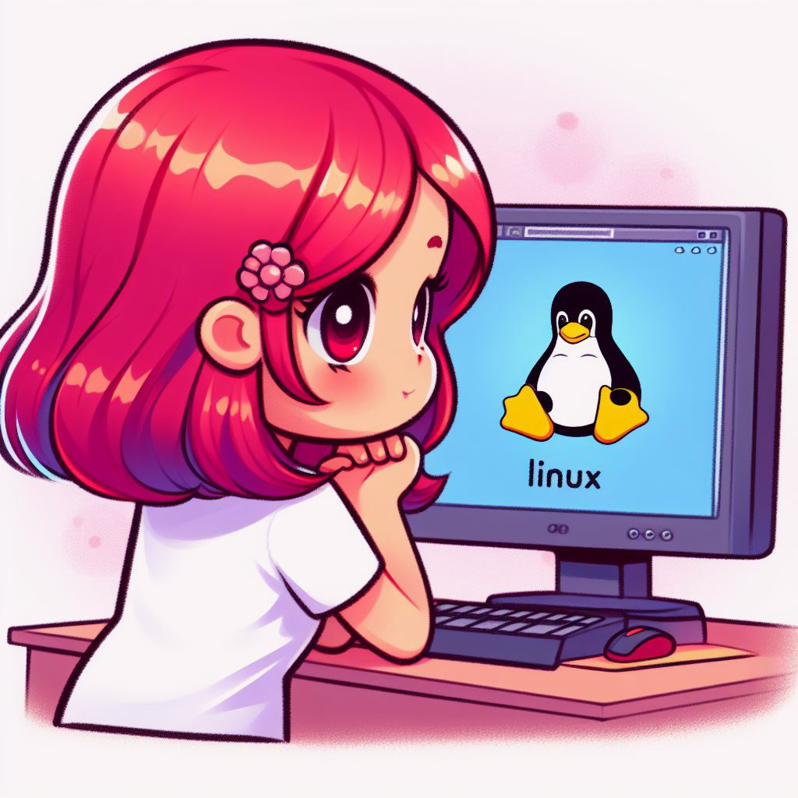

{: width="250" .float-left .mr-3 }
Wirtualna Maszyna z Linuksem
{: .fs-8 .ls-10 .code-example .fw-700}
Planując pracę z Ruby trzeba przestawić się z używania najpopularniejszego na komputerach osobistych systemu Windows, na któryś z rodziny systemów unixowych, takich jak Linux czy MacOS. Unixowe środowiska, dzięki wspólnym narzędziom, łatwiej obsługują kompilatory, systemy bibliotek oraz inne narzędzia potrzebne do budowy Ruby i bibliotek (gemów). Ruby, rozwijany pierwotnie na komputerach z systemem Unix, miał zawsze pierwszeństwo w dostosowywaniu się do tych systemów. W rezultacie, rozwijanie kodu Ruby na Windowsie wiązało się z problemami, których użytkownicy Maca czy Linuxa zazwyczaj nie doświadczają. W poszukiwaniu pomocy czy odpowiedzi na problemy, użytkownicy Windowsa mogą napotkać ograniczoną dostępność informacji w porównaniu do użytkowników innych systemów. Dlatego planując wdrożenie swojego kodu, warto rozważyć, na jakiej platformie chce się go uruchomić. Na przykład, tworząc aplikację w Ruby on Rails, prawdopodobnie będzie wdrożona na serwerze z systemem Linux. Względna zgodność środowiska deweloperskiego z produkcyjnym może pomóc uniknąć nieoczekiwanych komplikacji po uruchomieniu kodu na żywo.

Na szczęście nie trzeba od razu rzucać się na głęboką wodę i przeinstalowywać całego systemu na naszym komputerze na nowy 😊 Aby zacząć korzystać z Ruby w jego naturalnym środowisku, takim jak Linux, warto zaznajomić się z pojęciem maszyny wirtualnej. Maszyna wirtualna, np. VirtualBox, to rodzaj programu, który pozwala stworzyć wirtualny komputer wewnątrz twojego rzeczywistego komputera. To jak magiczna skrzynka, która pozwala uruchomić inny system operacyjny, jak na przykład Linux, na twoim komputerze Windows.

- **Pobierz VirtualBox:** Zacznij od pobrania VirtualBox - narzędzia, które pozwoli ci stworzyć tę wirtualną skrzynkę. Kliknij na link _Windows hosts_ [tutaj](https://www.virtualbox.org/wiki/Downloads).
- **Wybierz Dystrybucję Linuxa:** Następnie musisz wybrać wersję Linuxa, którą chcesz uruchomić w swojej wirtualnej maszynie. Dla początkujących polecam [Ubuntu](https://ubuntu.com/download/desktop) - jest popularne i łatwe w użyciu.
- **Konfiguracja VirtualBox:** Po pobraniu obu narzędzi, znajdziesz w internecie wiele prostych instrukcji, które krok po kroku pokażą ci, jak skonfigurować VirtualBox i zainstalować Ubuntu na maszynie wirtualnej. [Przykładowy tutorial tutaj](https://www.howtogeek.com/796988/how-to-install-linux-in-virtualbox/). Dzięki temu, będziesz mogła używać Ruby na systemie Unix, nawet jeśli na co dzień pracujesz na komputerze z systemem operacyjnym Windows.

Dodatkowo w razie problemów z wydajnością bądź kopiowaniem, mogą być koieczne dalsze kroki:
- [Instalacja Guest Additions](https://www.youtube.com/watch?v=zdkl16oAS1k)
- [Włączenie kopiowania](https://codetryout.com/virtualbox-ubuntu-enable-copy-paste/)