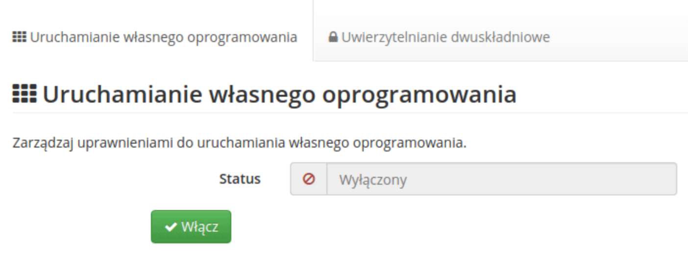
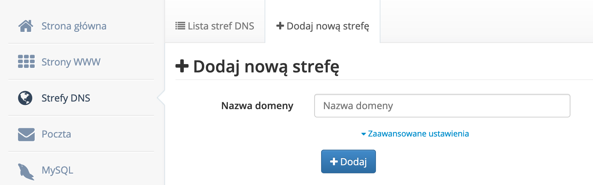
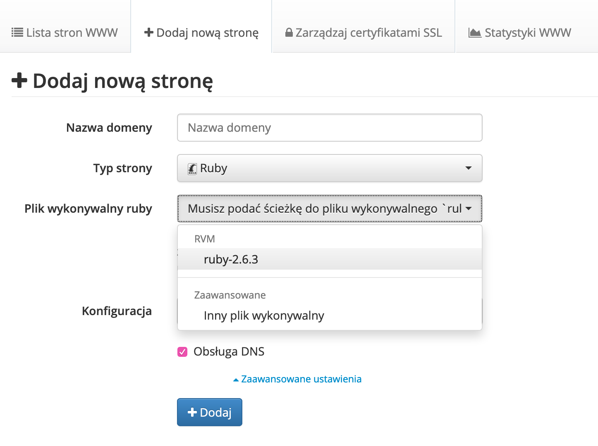
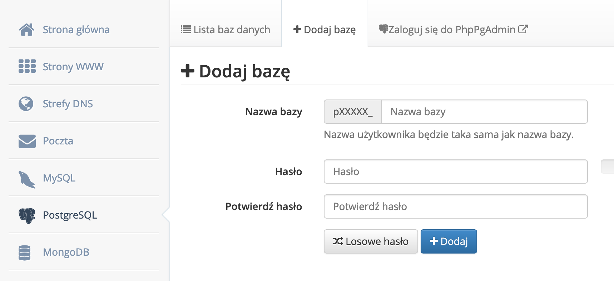

{: width="250" .float-left .mr-3 }
Uruchamianie aplikacji Ruby on Rails na darmowym serwerze ct8
{: .fs-8 .ls-10 .code-example .fw-700}

[CT8.pl](https://www.ct8.pl/) to darmowy i pozbawiony reklam hosting, którego pełną wersją jest [MyDevil.net](https://www.mydevil.net/). Wspiera on m.in. język ruby. Poniższy artykuł zawiera instrukcję jak uruchomić na serwerze aplikację napisaną w Ruby on Rails.

### Instalacja ruby

Należy zacząć od zalogowania się do [panelu](https://panel.ct8.pl/) używając otrzymanego w mailu hasła. Konieczne będzie aktywowanie [Binexec](https://wiki.mydevil.net/Binexec), można to zrobić poprzez pozycję z menu _Dodatkowe usługi_ i następnie zakładkę _Uruchamianie własnego oprogramowania_.


Kolejnym krokiem będzie zainstalowanie ruby korzystając z [RVM](https://wiki.mydevil.net/RVM). Należy zalogować się na serwer korzystając z danych otrzymanych w mailu:
```shell
ssh nazwaużytkownika@s1.ct8.pl
```
Wykonujemy polecania koniczne do zainstalowania RVM:
```shell
gpg --keyserver hkp://pool.sks-keyservers.net --recv-keys 409B6B1796C275462A1703113804BB82D39DC0E3 7D2BAF1CF37B13E2069D6956105BD0E739499BDB
```
```shell
curl -sSL https://get.rvm.io | bash -s stable
```
```shell
source .rvm/scripts/rvm
```
Instalujemy wybraną wersję ruby:
```shell
rvm install 2.3 --autolibs=disabled
```
Oraz bundler:
```shell
gem install bundler
```

### Tworzenie strony

Pierwszy krok jest opcjonalny, jeśli nie mamy własnej domeny. Można ją dodać pozycji menu _Strefy DNS_ w zakładce _Dodaj nową strefę_.


W końcu możemy przejść do tworzenia strony. Aby to zrobić należy wybrać _Strony WWW_, a następnie _Dodaj nową stronę_. W polu _Typ strony_ trzeba wybrać _Ruby_. Pojawi się wtedy kolejne pole _Plik wykonywalny ruby_, gdzie należy wybrać plik z listy lub ręcznie podać lokalizację interpretera ruby. Ostatnim polem koniecznym do uzupełnienia jest _Konfiguracja_ (produkcyjna, staging, deweloperska, testowa). Podczas stawiania pierwszej, testowej aplikacji może być warto wybrać wersję deweloperską, ze względu na jasne komunikaty z błędami.


W tym momencie mamy dostępny na serwerze katalog `/usr/home/login/domains/DOMENA/public_ruby/`, w którym będzie można umiejscowić [projekt Ruby on Rails](https://wiki.mydevil.net/Ruby_on_Rails).

### Baza danych

Bazę danych tworzymy z pozycji menu _MySQL_ lub _PostgreSQL_ w zależności od tego, której z nich chcemy użyć, zakładce _Dodaj bazę_. Poniższy przykład dotyczył będzie _PostgreSQL_. Uzupełniamy pole z nazwą, która będzie w formacie `pXXXXX_nazwabazy` oraz hasło.

Logując się przez SSH możemy sprawdzić dostęp do bazy. Zdalny dostęp do bazy w darmowej wersji hostingu nie jest możliwy.
```shell
pg_isready -d pXXXXX_nazwabazy -h pgsql.ct8.pl -p 5432 -U pXXXXX_nazwabazy
```
```shell
psql -d pXXXXX_nazwabazy -h pgsql.ct8.pl -p 5432 -U pXXXXX_nazwabazy
```
Korzystając z linku dostępnego w panelu możliwe jest też zalogowanie się do panelu PhpPgAdmina.

Pora na przygotowanie pliku `database.yml` z wykorzystaniem naszej nazwy użytkownika i bazy:
```yaml
production:
  <<: *default
  database: pXXXXX_nazwabazy
  username: pXXXXX_nazwabazy
  password: <%= ENV['DATABASE_PASSWORD'] %>
  host: 'pgsql.ct8.pl'
```

Wrażliwe dane najlepiej przechowywać w zmiennych środowiskowych. Możemy dopisać je do pliku `~/.bash_profile`.
```shell
nano ~/.bash_profile
```
```shell
DATABASE_PASSWORD=password
```
```shell
source ~/.bash_profile
```
lub
```shell
source ~/.bashrc
```
### Deployment

W tym momencie wystarczy umieścić kod aplikacji w katalogu `/usr/home/login/domains/DOMENA/public_ruby/`. Należy też pamiętać o zainstalowaniu zależności:
```shell
RAILS_ENV=production bundle install
```
Oraz odpaleniu migracji:
```shell
RAILS_ENV=production bundle exec rake db:migrate
```
Może też być konieczne [wygenerowanie credentiali](https://guides.rubyonrails.org/security.html#custom-credentials). Zmienną `SECRET_KEY_BASE` można dopisać do pliku ` ~/.bash_profile`.

Do uproszczenia deploymentu przydać się może gem [capistrano](https://github.com/capistrano/capistrano).
Parę użytecznych konfiguracji w pliku `deploy.rb`
```ruby
set :deploy_to, "/usr/home/nazwaużytkownika/domains/domena"
```
```ruby
set :tmp_dir, "/home/domena/tmp"
```
```ruby
task :link_public_directory do
  on roles(:app) do
    execute "ln -s #{current_path} /usr/home/nazwaużytkownika/domains/domena/public_ruby"
  end
end
after "deploy:published", "link_public_directory"
```
Oraz w pliku `deploy/production.rb`
```ruby
server "s1.ct8.pl", user: "nazwaużytkownika", roles: %w{app db web}
```
Aby możliwe było użycie capistrano, na serwerze należy jeszcze uruchomić polecenie:
```shell
ssh-keygen -t rsa -C "your_email@example.com"
cat ~/.ssh/id_rsa.pub
```
I dodanie klucza na GH.

Dodatkowo konieczna może być edycja Gemfile:
```ruby
if RbConfig::CONFIG['target_os'] =~ /(?i-mx:bsd|dragonfly)/
  gem 'rb-kqueue', '>= 0.2'
end
```